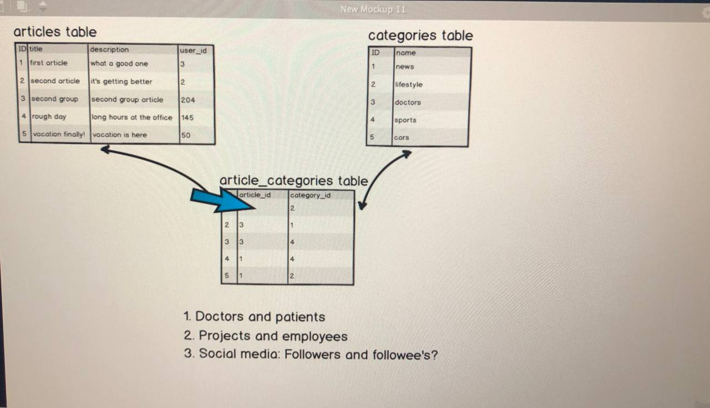
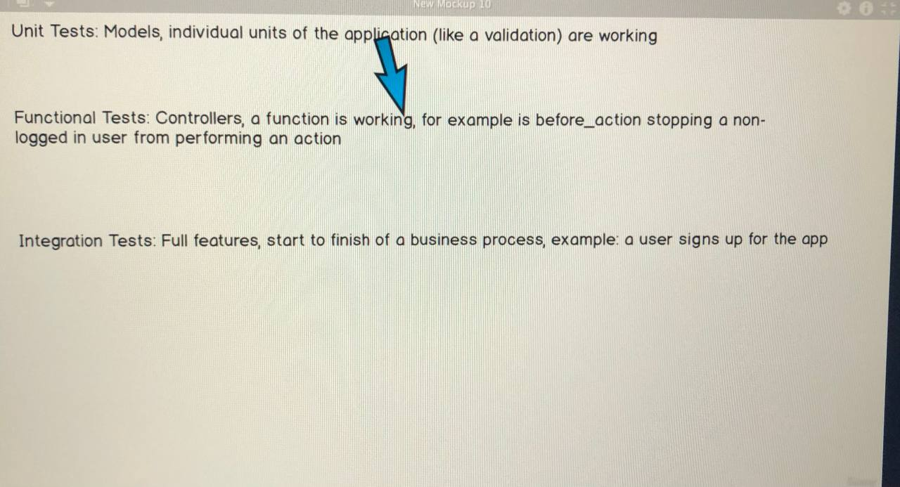

<h1> Rails syntax </h1>

When you want to **display data**, use `<%= %>`

When you **don't want to display data, just code**, use `<% %>`

Ex: 

    <% @article.each do |article| %>

    <tr>
        <td class="title"> <%= article.title %></td>
    
        <td class="desc"> <%= article.description %></td>
    </tr>
    <% end %>

-----------

<h1> Working with DB </h1>

<h2>CRUD</h2>

To create migration of data:
`rails generate migration [name]`
Then different files are appeared in migrate folder in db folder.

To make migration: `rails db:migrate`
After that, new fields are created in schema.rb

For updating our table (since we have only had migration), we should rollback the migration and add everything
again: `rails db:rollback` and then `rails db:migrate`

**BUT THIS IS A TERRIBLE APPROACH.**

Actually, when you work in the team, it would be much better to create
**new migration file** where a developer see every change. 

To do this, generate a new migration file by `rails generate migration [another_name]
` and update the column by adding timestamps. **What is good, WebStorm
generates it automatically.**

______
**CREATING A RECORD**

Let's create a new table in the models folder. 
The first model is Article model. We can use it with Rails console: `rails c`
To exit from it: `exit`

We'll see all articles from the Article table by `Article.all` in rails console.
For now it is [].

To create a new record: `Article.create(title: 'first_article', description: 'Info about first article')`
The record is created. 

**THIS IS GOOD** But, a preferable way to create a record is by making an 
instance of the class. 
`article = Article.new`

Right now the article is full of nil:  
`#<Article:0x000001f0b685c2c8 id: nil, title: nil, description: nil, created_at: nil, updated_at: nil>`
But we can fill the fields like:   `article.title = 'The second article'` and 
`article.description = 'The info about the second article'`

So, the result is `#<Article:0x000001f0b685c2c8 id: nil, title: "The second article", description: "The info about the second article", created_at: nil, updated_at: ni
l>`

Id is still nil. This shows us that that article is not IN THE DB TABLE.
Once it is in the db table, id is filled automatically.
Save it by `article.save!`
Thus, the SQL transaction is created and the 2nd article is in the db now.
Use `Article.all` to see all articles.

And we use can use constructor: `Article.new(title: 'Third article', description: 'The info about the 3rd article')`
and then save to db `article.save!`

_____
**READ AND UPDATE A RECORD**

Let's find a record: `Article.find(index)` and find an element with index 2.

Display the first article: `Article.first` and the last article: `Article.last`.
It is also much better to USE INSTANCE OF THE CLASS.

To update an article we use the instance of the class and a record field.
In essence, let's change the third article.
First, find it by `article = Article.find(3)`. Then, update it by `article.description = 'hehehehehehe`.
Save it to the database: `article.save!`.

______
**DELETE A RECORD**

Let's destroy the third article by `article.destroy`. The article is returned, but when you enter `Article.all`, there is
no article 3. There is no need to save anything.

_________________

<h1> Validation of records </h1>
By now, we can save empty records. This is not okay. There are no restrictions in article.rb file,
so we'll create them. First, we'll make sure that title of the article is necessary to fill in by

`validates :title, presence: true` in the Article class in article.rb. 
To save these changes to the model, use `reload!`
So, when we'll try to create an article without a title by `article = Article.new` and use `article.save`, `false` will be returned.
To see an error: `article.errors.full_messages`. ["Title can't be blank"] is returned.
<h3>But we'll see the error only when we save the entity to db or we validate it by`article.valid?` </h3>

Let's go further and validate description. Write `validates :description, presence: true` in the Article class.
We can also specify the length of the field by using `length: {mimimum: , maximum: }`
To save these changes to the model, use `reload!`

**To see other validation methods, use** https://guides.rubyonrails.org/active_record_validations.html

<h1>Route, action, view</h1>

<h3>Helpers are for views, controllers for code </h3>

<h3>When a request is made from the browser, which part of the rails application receives this request?

The router receives the request and routes it!</h3>

By writing `resources :articles` in routes.rb file and using `rails routes --expanded` in the 
console (an ordinary console, not rails), we'll see all routes and controllers in console.

Don't forget to specify exactly your URI, bec when using `resources :articles`, Rails create
a whole bunch of unnecessary routes, so, use `resources :articles, only: [:..., :...]` to
specify what routes will be used in your application.

`resources :articles, only: [:show, :index, :new, :create, :edit, :update, :destroy]` =>

1. `/articles` to show all articles

2. `/articles/1` to show the first article

3. `/articles/new` to create a new article

4. `/articles/1/edit` to update a first article

5. `/articles/1` to destroy a first article

We can render the new article to the page. But this is only render, it is not
saved in the db.
When creating a new article, nothing might happen and a new article is not saved.
This is because we don't render it in `create` method in Articles controller. 
By using `render plain: params[:article]`, we'll specify what is going to be rendered: a new article.
So, on `'/articles'`, a new article will be returned: `{"title"=>"eweqweqwe", "description"=>"qweqeqweqwewqe"}`
**But, it only renders by the browser, the new article is NOT saved yet**.

Sometimes, we might encounter a problem with turbo. 
I had a problem with rendering a new article. It didn't return a new article.
The solution for it is to add `data: { turbo: false }` in the form.
The form in in new.html.erb file.

To save to db, we need to use following in the articles controller:

`:article` is our db model

`@article = Article.new(params.require(:article).permit(:id, :title, :description))`

`@article.save!`

`redirect_to article_path(@article)`

Thus, we'll create a new article object from params, which permits fields. 
To redirect to /articles/id, use `rails routes --expanded`, find `/articles/:id` URI and method GET
PREFIX here is to access: `article` (which is a prefix)`_path` (which means path), rails will 
extract `id` from `@article` class instance. 

______________________________________________________________________

**EDIT AN ARTICLE**

Let's see what `/articles/:id/edit` has. It is an error page, saying there is
no template for this page. Let's create `edit.html.rb` then. We want to update
the article, so we need the form to do this. 
But it is not the form to create. In case of editing form, we want to display all existing info about the
article. 
Why using `@article` instance, not the particular model? We want to show info about the particular 
article and change the info of a particular info.

We still have a problem. `undefined method errors for nil:NilClass`
This is because `@article` is not instantiated yet. 

We'll instantiate the model in edit method: `@article = Article.find(params[:id])`.
So, we'll want to update the twelfth article: `/article/12/edit`, update it, 
then, click on the button. Nothing happens. Why? Fill `update` action.

Then, we'll update it (means update in db) by finding a particular article, updating it
and redirecting to the `/article/:id` in `update` method.

_______________________________________________

**DELETING AN ARTICLE**

We'll have a link, which if clicked, the entity will be deleted.
Look at `index.html.erb` file. We'll embed the link:
`<%= link_to 'Delete', 
article_path(article.id), data: {
turbo_method: :delete,
turbo_confirm: "Are you sure?"
} %>`

**Notice that without `turbo_method` and `turbo_confirm` the entity won't be deleted.**
`method: :delete` really doesn't work. 
It needs to be `turbo_method: :delete` if you are using Rails default stack. 

See https://guides.rubyonrails.org/getting_started.html#deleting-an-article


We'll delete the entity, which is found by 
`Article.find(params[:id])`.

Then, we'll redirect to our main page, which is `/articles`. 

<h1>Refactoring</h1>

We can extract some parts of code in .erb files as they look nasty.
We can do this by creating partials folder and extracting 
some code in the files there. In order Rails to understand that
this is a partial file, use _ in the name. 

___________________
<h1>Setting up associations</h1>

**Rails supports six types of associations:**

belongs_to

has_one

has_many

has_many :through

has_one :through

has_and_belongs_to_many

<h2>One-to-many association</h2>

1) The first step we' ll be doing is adding a new
column to articles table `user_id` in a new migration file:
   `add_column :articles, :user_id, :integer`.

    So, when we run `Article.all` in rails console after
`rails db:migrate`, all our entities will have a user_id field.


2) We'll add `has_many :articles` in User model and
`belongs_to :user` in Article model.

To test it: when entering `user1.articles` in rails console,
we get 
`SELECT "articles".* FROM "articles" WHERE "articles"."user_id" = ?  [["user_id", 1]]
=> []`

Let's create a new article for the first user in rails console by:
`user1.articles.build(title: 'hey man nice shot', description: 'the Rolling Stones great hits')`, so
when we enter `user1.articles`, the created rolling stones article will appear.

Let's consider that `article` is a first article and  `articleLast` is the last article.

`user2.articles << article`
and `user2.articles << articleLast`

Thus, the array of elements will be returned: [ <el with id 1>, <el with id 25> ]

**But now when we run the server, we couldn't edit the article (except the article connected with the user).
This is because now to update an article we need a `user_id`.**

<h1> NEVER DO ROLLBACK TO YOUR DB. CREATE A NEW MIGRATION
FILE AND USE `add_column` IF YOU NEED TO MAKE A NEW COLUMN FOR A 
PARTICULAR TABLE.</h1>

**To reload the console, use:** `reload!`

Remember that every our article now needs a user_id to update? Good.
We also need a user_id to create an article. 
Let's go to Article controller and write `@article.user_id = Article.first.user_id`
in Create action. This is for our first article. Other articles we'll be assigned to the user through 
rails console: `Article.update_all(user_id: User.first.id)`
Now, all articles are assigned to the first user in our User table and all of them have `user_id` of 4.

To dynamically show all the users, code `by <%= article.user.username %>`
in the .each loop in the index.html.

_________________
We also should be sure about our email validation.
Let's add `before_save { self.email = email.downcase }` in our User model.
**`self` means every user object, being created.**
So, if we enter user's email 'JoHn@gmail.com', and then enter `.save!` in 
the rails console, the email will be automatically changed to 'john@gmail.org'.

<h1>Adding Secure Password</h1>

**As it is known, ordinary passwords are not saved into db.
They are saved in the hash format. The hash variant is always
stable. And a hacker can hack the db and get a hash variant. 
So, in order to keep your password save, the salt is added.
Salt is a piece of a random data, so every time the password
of a new user runs through hashing algorithm, the salt is added.**

1) Let's create a new migration, called `add_password_digest_to_users`.
2) In the migration file, use `add_column :users, :password_digest, :string`.
3) When we run migration and open the rails console and enter `User.all`, we'll see
that every user has a `password_digest` field, which is `nil` now.
4) Add `has_secure_password` field to User model.
5) Run `my_password = BCrypt::Password.create("kekekek")` in the console and
then, the hashed version of a password will appear. If we run again, the 
hash would be kind of different. This happens because of salt.
6) To see the salt of the hash password, use `my_password.salt`.
7) Let's add the ordinary password to our last user (it will be hashed anyway) by
`lastUser.password_digest = 'smth'` and run `lastUser.save!`. The password is saved and hashed.

_________________
<h1>New user signup form</h1>

Let's go to routes and add there `get 'signup', to: 'users#new' `.
Then, generate controller and a view.
In the view, 'users/new', we'll create a form to create a new user. 
Using `email_field` allows us to check an email field.
In essence, if we use an inappropriate email, then the error appears.


And we can fill the form, but there'll be an error cause no `create` method is used in
controller yet.
To see the `params` of your hashed data, use `params` in `binding.break` console.

<h1>Editing exising users</h1>

To see all `/edit` routes (a specific routes), use `rails routes --expanded | grep edit`.


We need `/users/:id/edit(.:format)`. We'll create `edit` and `update` methods.

<h3> As we are in a different branch, we'll use merging: </h3>

`git status` => `git branch` => `git add .` => `git status` => 
`git commit -m '...` => `git checkout master` => `git merge [nameOfAnotherBranch]`

_______________________

<h1>Show a user, profile picture</h1>

**Although we can edit the user on `/users/:id/edit`, when we route to `/users/:id`,
we see `The action 'show' could not be found for UsersController` because
we didn't define `show` method in User controller.**

Then, we will add in html.erb file:
  `<h1 class="text-info"> All info about the person is here: </h1>`

  `<p class="text-muted"> Username: <%= @user.username %></p>`

  `<p class="font-weight-bold"> Email: <%= @user.email %></p>`


**In order to use avatar pictures, let's use Gravatar**

Gravatar will make the profile image associated with the email.
(Thanks to Wordpress)
If a person does not have any account on Gravatar, then just ordinary
avatar pic appears instead of image. 

Let's test it in the Ruby console (making avatar for @whiteblinders user):

1) Write `email_address = "valcat552@gmail.com"`
2) Then `hash = Digest::MD5.hexdigest(email_address)`
3) Compile url (for ) with `image_src = "https://www.gravatar.com/avatar/#{hash}"` 

Now, it's good. let's make it in the rails app.
We will define `gravatar_for(user)` method in the `users_helper.rb`. 
**We can use these helper methods later in the views**

We'll do the same thing in `gravatar_for(user)` as we did earlier in the rails console.
Plus, we'll add the img src url and alternative text in the
`image_tag` built-in method: `image_tag(image_src, alt: user.username)`.

The, add it to the `show.html.erb` file: `<%= gravatar_for @user %>`

Then, when we look to `/users/[:id]`, the avatar should appear.

-----------------------

<h1>Redirect when updating a user</h1>

**Earlier we didn't have `show` action in users controller, so we redirected to all articles page.
Now, when `show` is created and filled in, we can redirect to the actual user, using
`redirect_to user_path(@user)`, which is the same as `redirect_to @user`.**

---------------------
<h1>Add pagination (limitation of articles on the page)</h1>

Let's make a limitation for each page: only several articles will be available on the 
page. The same amount of articles will be available on the other page and etc.

1) Add `gem 'will_paginate', '~> 3.3'`
2) Go to articles controller and change `@article = Article.all` to
`@article = Article.paginate(page: params[:page], per_page: 10)` 
Thus, every 10 articles will be displayed on every page.
3) Then render page links in the articles/index.html view: `<%= will_paginate @article %>`
4) In order to use styling techniques, better wrap render page links into the div. Look at index view.

The same is for users.

<h2> You can use `article_path` when we want to work with all articles. 
If you mean to work with a particular article, use `article_path(@article)`. The same is for users.  </h2>
---------------
<h1>LOGIN/LOGOUT</h1>

<h3>Login and logout</h3>
Let's create a login form.
1) Go to `routes` and enter following routes: `get 'login', to: 'sessions#new'` and
   `post 'login', to: 'sessions#create'` and 
   `delete 'logout', to: 'sessions#destroy'`

**We'll have to manually write routes (instead of using `resources`) as login won't affect our db at all.**
2) Create controller for sessions.

3) Create a form in `sessions/new.html.erb`. We can omit the scope. 
4) We will login (`/login`) with the help of `new` action. When logging in, we'll go to `/login` (which is proceeded by post 
request and `create` controller)
5) In `create` controller, we will find the user by email and authenticate the user. We'll be using sessions, and
they are available by using `session` object. We'll also change a line in create action of users,
we will save their id with every session.
In application controller we'll create a `current_user` and `logged_in?` methods and use them
as helper methods. 

**There, we will use memoization. Without memoization, we'll need to query the db every time to 
find a user but if we already referenced a current user and have current user object 
available, then we can return a current user: `@current_user ||= User.find(session[:user_id]) if session[:user_id]`
Otherwise, we'll need to query the db to find a user.**

Also, we'll save our user id from forgery attack (including malicious links and etc) to an application.
**All sessions are special secure cookies.**
6) To destroy our session, we will set our session of the user to nil. In **Browser Tools, in Application window** we can see
that a **user has session 1 when logging in**. When logging out, session ends.
7) Now, as login code is completed, we will assign every new article to a logged in user, we'll go to
`create` method in articles controller and put there `@article.user_id = current_user.id`.

Source: https://www.theodinproject.com/lessons/ruby-on-rails-sessions-cookies-and-authentication


------------------
<h1>Restricting in controllers</h1>
Restricting in UI is good, but if we are not logged in, we still can create a new article when going to

`users/new`

Let's restrict it in application controller and then go to articles controller and specify when this restriction is 
not needed: `before_action :require_user, except: [:show, :index]`

--------------
<h1>Deleting the user and articles of this user</h1>
We'll create a 

`destroy` action in users controller. Anyway, when we delete user,
the articles of this user stay, which is wrong. 
To delete all articles with this user, use `has_many :articles, dependent: destroy` in user model.
Then, just reload the browser. 

--------------
<h1> Permissions functionality, adding admin user functionality </h1>

First, we will add `admin` column to user table. For all users value would be `false`, except one.
Generate a new migration file: `rails generate migration add_admin_to_users`, add column there and run `rails db:migrate`.
**We can see changes in `schema.rb` file.**
To check if user is admin, type: `user = ...` and `user.admin?`.

Let's set whiteblinders to be admin. 
**To toggle db, use: `user.toggle!(:admin)`. This will change boolean value to opposite.**

**To render text, without using styles, use `<%= "Admin" if current_user.admin? %>` in user/show file.**

Since whiteblinders is admin, we want to give him/her permission to edit or delete articles of other users by 
using `current_user.admin?` in edit views. 

-----------------
<h1>Many-to-many association and testing</h1>

**We'll create a Category for each article. Each article will have a category.
Many articles can belong to one category. One category can have many articles. This is why we need many-to-many association.**

**To have it, we'll create a separate table, which will store article_id and category_id.**


**We will also use testing for our purposes.**


**To test our controllers, go to test/controllers.**

<h3>To minitests</h3>
`assert true`

An assertion is a line of code that evaluates an object (or expression) for expected results. 
For example, an assertion can check:

1) does this value = that value?
2) is this object nil?
3) does this line of code throw an exception?
4) is the user's password greater than 5 characters?

Every test may contain one or more assertions, with no restriction as to how many assertions are allowed. 
Only when all the assertions are successful will the test pass.

All the basic assertions such as assert_equal defined in Minitest::Assertions are also available in the classes we use in our own test cases. In fact, Rails provides the following classes for you to inherit from:

```
1) ActiveSupport::TestCase
2) ActionMailer::TestCase
3) ActionView::TestCase
4) ActiveJob::TestCase
5) ActionDispatch::IntegrationTest
6) ActionDispatch::SystemTestCase
7) Rails::Generators::TestCase
```

Each of these classes include `Minitest::Assertions`, allowing us to use all of the basic assertions in our tests.

**We can run all of our tests at once by using the `rails test` command in the terminal. 
Or by `rails test test/[folderName]` to run particular tests in one folder, like `rails test test/controllers`. 
Or by `rails test test/[folderName]/[fileName]` to run a specific test, 
like `rails test test/controllers/category_controller_test.rb`.**

____________
**Let's go to test/models and since we want to test the Category model (which does not exist now), we will create a file
`category_test` to test our Category model. When we created User model via `generate...`, the test file `user_test` is 
created automatically.**

We will test our `@category` object to see if it is valid or not (remember, Category model is not created yet):
```
test "category should be valid" do 
    @category = Category.new(name: 'Sports')
    assert @category.valid?
  end
```
**The test will result in error, as no Category model exists. The thing is: we always need to write tests firstly.
This is what test-driven-development is.**

Let's create it with `rails generate model [name]`. In migration file we'll add name field. 
We can go `rails test` or use `Category.all` in rails console.
We'll create a new category object by `@category = Category.new(name: 'sports')` and check it with `@category.valid?`

Let's make another test: `name_should_be_present`.
And we will say that name should not be blank.
In the first run we'll have:
```
Failure:
CategoryTest#test_name_should_be_present [/mnt/c/Users/Arina/RubymineProjects/rubyUdemyCourse/introToRoR/aphablog/test/models/category_test.rb:11]:     
Expected true to be nil or false
```

**This is because we haven't done any validation in the model yet. So, it was expected to result in false.
But it resulted in true, @category is valid, so blank category names are allowed.**

Let's now make validations in our Category model.

<h3>Remember that each @category object is not available outside of each test. This is why we always need 
to create a new @category obj in each test.</h3>

For test `should be unique` we'll make a new validation in the model, `validates_uniqueness_of :name`.

______________
**Let's now switch to Category controller. This is what functional tests are created for.**
Go to `category_controller_test.rb`. 

**We will use `.create` instead of `.new` in setup as we want to hit the database.
We'll create some tests to test the routes. In `should_get_category` test we'll need to create an object instance, `@category`.
We will do this with the `.create` method in setup as without it we would not hit the db and find the index to 
show a particular category.**

**When running `rails test`, we'll have errors as `undefined local variable or method [...]_url' for...` as
Rails can not find any route because we did not create them.**

Go to routes file and add `resources :category, except: [:destroy]`.
We still have errors like `The action 'show' could not be found for CategoryController`. This is because we need to 
create actions in the controller.

--------------------
We should be able to create categories in the browser.
We'll create test for it `should create category`. When running, we'll encounter error: `"Category.count" didn't change by 1.`.
Let's create a category in the browser by building the form.


    


